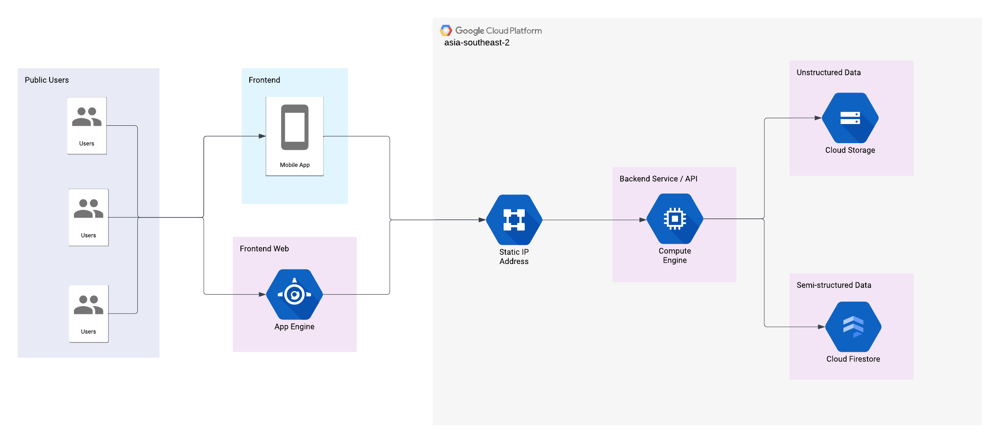

# Water Eye Documentation

## Table of Contents

1. [Introduction](#introduction)
2. [Features](#features)
3. [System Architecture](#system-architecture)
4. [Installation Guide](#installation-guide)
5. [Usage](#usage)
6. [Frontend Details](#frontend-details)
7. [Backend Details](#backend-details)
8. [Dataset and Model](#dataset-and-model)
9. [Future Development](#future-development)
10. [Acknowledgements](#acknowledgements)

---

## Introduction

Water Eye is an innovative application aimed at improving water quality monitoring by leveraging computer vision and cloud computing. The system enables users to upload water images for real-time quality analysis, ensuring accessibility, reliability, and practicality for various stakeholders, including environmental agencies and individual users.

## Features

- **Water Quality Assessment**: Analyze images to detect and assess water quality based on visual characteristics like color and turbidity.
- **Non-Water Image Detection**: Minimize false positives by identifying and filtering out non-water elements.
- **User-Friendly Interface**: Simple, intuitive web-based frontend for ease of use.
- **Scalable Architecture**: Cloud-based infrastructure for seamless scalability and performance.

## System Architecture

The system consists of the following components:

- **Frontend**: A web-based interface built with React.js for user interactions and also Mobile Application.
- **Backend**: APIs developed using Express.js, hosted on Google Cloud Compute Engine.
- **Machine Learning Model**: A convolutional neural network (CNN) built with TensorFlow.
- **Storage**: Google Cloud Storage for image uploads and Firestore as the database.



---

## Installation Guide

### Prerequisites

- Python 3.x
- Node.js
- npm or yarn
- Google Cloud SDK (for deployment)

### Steps

1. Clone the repository:

- Main BE:

```bash
git clone https://github.com/adeprastya/water-eye.git
cd water-eye
cd be
cp .env.example .env
# fill out the environment variable based on your cloud configuration
npm i
npm run start
```

- Model BE:

```bash
git clone https://github.com/adeprastya/water-eye.git
cd water-eye
cd be-model
pip install -r requirements.txt
python app.py
```

- Web FE:

```bash
git clone https://github.com/adeprastya/water-eye.git
cd water-eye
cd fe
npm i
cp .env.example .env
# fill out the environment variable based on your cloud configuration
npm run dev
```

## Usage

1. Open the application through the deployed URL or localhost (for local setup).
2. Upload an image of water for analysis.
3. View the real-time analysis results, including water quality indicators.
4. Access the history and recommendations for water quality improvement.

---

## Frontend Details

- **Deployed Url**: http://water-eye-442016.et.r.appspot.com
- **Framework**: React.js
- **Design Tool**: Figma (prototyping)
- **Libraries**: Axios for API calls, Tailwind for styling.

---

## Backend Details

- **Deployed Url**: http://35.219.47.173:3000
- **Framework**: Express.js
- **Database**: Firestore
- **Storage**: Google Cloud Storage
- **Endpoints**: ./doc/api-spec.yaml

---

## Dataset and Model

- **Dataset**: Custom dataset containing images of water with varying quality levels.
- **Model**: Convolutional Neural Network (CNN) using TensorFlow.
- **Training**:
  - **Preprocessing**: Resized all images to 224x224.
  - **Transfer Learning**: Fine-tuned on pre-trained models like MobileNet.
  - **Metrics**: Achieved 95% accuracy on the test set.

---

## Future Development

- Expand dataset to include more diverse water quality scenarios.
- Add location feature to find out the quality of water in the world.
- Incorporate offline functionality for areas with limited connectivity.

---

## Acknowledgements

- **Google Cloud Platform** for hosting.
- **TensorFlow** for machine learning support.
- Mentors and team members for guidance and collaboration.
